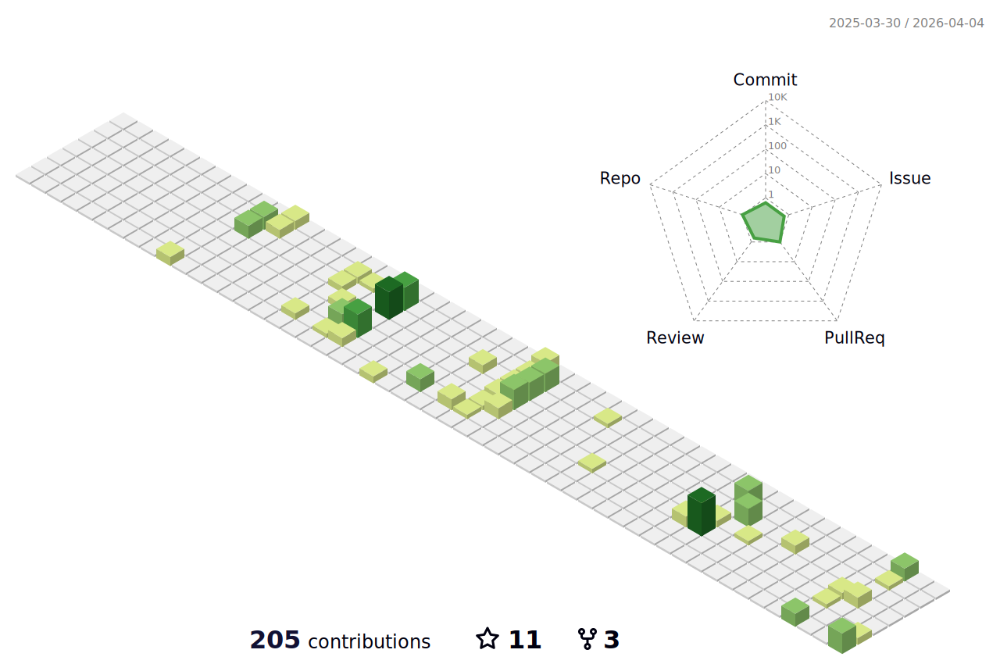

# Hi there! 👋

  
  
  
  
    
  
  

  
  
  
  
  
  
  

  
  
  
  

  My name is Jordan (He/Him) :gb: and I'm a student studying _Data Science & Analytics_ at [Bournemouth University](https://en.wikipedia.org/wiki/Bournemouth_University) :mortar_board:. Prior to studying at BU, I studied Cyber Security at [Bristol UWE](https://en.wikipedia.org/wiki/University_of_the_West_of_England) before deciding to switch to data science. I'm currently on my placement (junior) year where I work at [Lawrence Berkeley National Laboratory](https://en.wikipedia.org/wiki/Lawrence_Berkeley_National_Laboratory) in the [San Francisco Bay Area](https://www.google.com/maps/place/San+Francisco+Bay+Area) :us:. At the lab, I work with teams of incredible scientists and researchers on open research projects involving solving problems using neural networks and deep learning.

It's here, during both work and my free time where I have written most of my open-source software.

- [`openjson`](https://github.com/JordanWelsman/openjson) is a Python module that provides fiexible JSON serialization and I/O functionality in a modular implmentation. It empowers users to control how their JSON files are written and can be used in a plethora of Python applications.
- [`jutils`](https://github.com/JordanWelsman/jutils) is another project of mine which collates the many useful tools and code snippets I've written and used in my other data science and Python projects in a nice importable package for other developers to use.
- [`nexport`](https://github.com/JordanWelsman/nexport) is a Python project of mine which allows users to exports the parameters of deep neural networks to human-readable filetypes. It relies on the functionality of `openjson` for its flexible JSON encoding and `jutils` for its useful importable utilities.
- [`mathplug`](https://github.com/JordanWelsman/mathplug) is a Python module which contains importable mathematical functions and equations for use in applications which require complex problem solving with simple I/O.
- I've also made contributions towards [`inference-engine`](https://github.com/BerkeleyLab/inference-engine), a neural network inference framework written in [FORTRAN](https://en.wikipedia.org/wiki/Fortran) on a research project in which it is deployed in [ICAR](https://ral.ucar.edu/solutions/products/intermediate-complexity-atmospheric-research-icar), an accelerated atmospheric simulation model.

## Stats
<a href="https://github.com/JordanWelsman">
    <picture>
        <source
        srcset="https://github-readme-stats-git-masterrstaa-rickstaa.vercel.app/api?username=JordanWelsman&show_icons=true&theme=vue-dark&hide_border=true"
        media="(prefers-color-scheme: dark)"
        />
        <source
        srcset="https://github-readme-stats-git-masterrstaa-rickstaa.vercel.app/api?username=JordanWelsman&show_icons=true&theme=vue&hide_border=true"
        media="(prefers-color-scheme: light), (prefers-color-scheme: no-preference)"
        />
        
    </picture>
</a>

<a href="https://github.com/JordanWelsman?tab=repositories">
    <picture>
        <source
        srcset="https://github-readme-streak-stats.herokuapp.com/?user=JordanWelsman&theme=vue-dark&hide_border=true"
        media="(prefers-color-scheme: dark)"
        />
        <source
        srcset="https://github-readme-streak-stats.herokuapp.com/?user=JordanWelsman&theme=vue&hide_border=true"
        media="(prefers-color-scheme: light), (prefers-color-scheme: no-preference)"
        />
        
    </picture>
</a>

<!--

  <picture>
    <source
      srcset="https://github-profile-summary-cards.vercel.app/api/cards/profile-details?username=JordanWelsman&theme=github_dark"
      media="(prefers-color-scheme: dark)"
    />
    <source
      srcset="https://github-profile-summary-cards.vercel.app/api/cards/profile-details?username=JordanWelsman&theme=github"
      media="(prefers-color-scheme: light), (prefers-color-scheme: no-preference)"
    />
    
  </picture>

-->

## Projects

<a href="https://github.com/JordanWelsman/openjson">
    <picture>
        <source
        srcset="https://github-readme-stats.vercel.app/api/pin/?username=JordanWelsman&repo=openjson&theme=vue-dark&hide_border=true"
        media="(prefers-color-scheme: dark)"
        />
        <source
        srcset="https://github-readme-stats.vercel.app/api/pin/?username=JordanWelsman&repo=openjson&theme=vue"
        media="(prefers-color-scheme: light), (prefers-color-scheme: no-preference)"
        />
        
    </picture>
</a>

<a href="https://github.com/JordanWelsman/jutils">
    <picture>
        <source
        srcset="https://github-readme-stats.vercel.app/api/pin/?username=JordanWelsman&repo=jutils&theme=vue-dark&hide_border=true"
        media="(prefers-color-scheme: dark)"
        />
        <source
        srcset="https://github-readme-stats.vercel.app/api/pin/?username=JordanWelsman&repo=jutils&theme=vue"
        media="(prefers-color-scheme: light), (prefers-color-scheme: no-preference)"
        />
        
    </picture>
</a>

<a href="https://github.com/JordanWelsman/nexport">
    <picture>
        <source
            srcset="https://github-readme-stats.vercel.app/api/pin/?username=JordanWelsman&repo=nexport&theme=vue-dark&hide_border=true"
            media="(prefers-color-scheme: dark)"
        />
        <source
            srcset="https://github-readme-stats.vercel.app/api/pin/?username=JordanWelsman&repo=nexport&theme=vue"
            media="(prefers-color-scheme: light), (prefers-color-scheme: no-preference)"
        />
        
    </picture>
</a>

<a href="https://github.com/JordanWelsman/mathplug">
    <picture>
        <source
        srcset="https://github-readme-stats.vercel.app/api/pin/?username=JordanWelsman&repo=mathplug&theme=vue-dark&hide_border=true"
        media="(prefers-color-scheme: dark)"
        />
        <source
        srcset="https://github-readme-stats.vercel.app/api/pin/?username=JordanWelsman&repo=mathplug&theme=vue"
        media="(prefers-color-scheme: light), (prefers-color-scheme: no-preference)"
        />
        
    </picture>
</a>

<a href="https://github.com/BerkeleyLab/inference-engine">
    <picture>
        <source
        srcset="https://github-readme-stats.vercel.app/api/pin/?username=BerkeleyLab&repo=inference-engine&theme=vue-dark&hide_border=true"
        media="(prefers-color-scheme: dark)"
        />
        <source
        srcset="https://github-readme-stats.vercel.app/api/pin/?username=BerkeleyLab&repo=inference-engine&theme=vue"
        media="(prefers-color-scheme: light), (prefers-color-scheme: no-preference)"
        />
        
    </picture>
</a>

<a href="https://github.com/JordanWelsman/JordanWelsman">
    <picture>
        <source
        srcset="https://github-readme-stats.vercel.app/api/pin/?username=JordanWelsman&repo=JordanWelsman&theme=vue-dark&hide_border=true"
        media="(prefers-color-scheme: dark)"
        />
        <source
        srcset="https://github-readme-stats.vercel.app/api/pin/?username=JordanWelsman&repo=JordanWelsman&theme=vue"
        media="(prefers-color-scheme: light), (prefers-color-scheme: no-preference)"
        />
        
    </picture>
</a>

## Contribution Graph

<picture>
    <source
    srcset="./profile-3d-contrib/profile-night-view.svg"
    media="(prefers-color-scheme: dark)"
    />
    <source
    srcset="./profile-3d-contrib/profile-green-animate.svg"
    media="(prefers-color-scheme: light), (prefers-color-scheme: no-preference)"
    />
    
</picture>

## Education

- BSc (Hons) Data Science & Analytics - Bournemouth University
  - Python, Flask
  - HTML, CSS, PHP, JavaScript
  - Java, Kotlin
  - Oracle SQL, MySQL
- BSc (Hons) Cyber Security & Digital Forensics - University of the West of England
  - Git, GitHub
  - C, C++
  - Microsft SQL, MongoDB

## Experience

- Student Assistant - Berkeley Lab
  - Contributed to [cutting-edge](https://en.wikipedia.org/wiki/Perlmutter_(supercomputer)) computational research projects
  - Contributed towards peer-reviewed, journal-published research papers
  - Developed many open-source [software repositories](https://github.com/JordanWelsman?tab=repositories)
  - Published several [Python packages](https://pypi.org/user/welsman) to the public domain
  - Learned how to administer workflows on [version-control](https://github.com) platforms

## My hardware & software

This is my current development environment.

-000000?style=for-the-badge&logo=apple&logoColor=white)
-E07B33?style=for-the-badge&logo=macos&logoColor=white)

-000000?style=for-the-badge&logo=apple&logoColor=white)
-E07B33?style=for-the-badge&logo=macos&logoColor=white)

-76B900?style=for-the-badge&logo=msi&logoColor=FF0000)

## Links

[:envelope: Send me an email](mailto:jordan.welsman@outlook.com)

<!--
**JordanWelsman/JordanWelsman** is a ✨ _special_ ✨ repository because its `README.md` (this file) appears on your GitHub profile.

Here are some ideas to get you started:

- 🔭 I’m currently working on ...
- 🌱 I’m currently learning ...
- 👯 I’m looking to collaborate on ...
- 🤔 I’m looking for help with ...
- 💬 Ask me about ...
- 📫 How to reach me: ...
- 😄 Pronouns: ...
- ⚡ Fun fact: ...
-->
